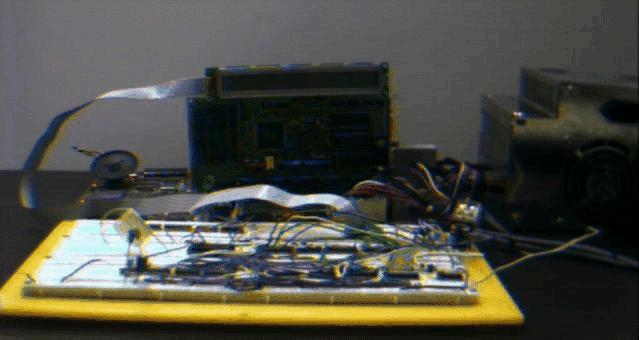

# Fridge


Note: All statements here are from 1996, and should be taken from a historical standpoint.


<figure><figcaption>
The Computer Systems Lab Sysadmin Fridge (1996)
</figcaption></figure>

### What is this?

The TJHSST Computer Systems Lab Sysadmin Fridge is a **Cyber 910 Graphics workstation** that opens to reveal a 18"x20"x20" refrigerator. The fridge cannot be opened externally; it is locked from the inside and only openable by computer.

### What computer?

The fridge is operated by connecting to `fridge.tjhsst.edu`, a 386 motherboard and network card directly connected to the fridge. Once authenticated, a sysadmin may send the "open fridge" command to open it up. This is the only way to open the fridge.

### Wow! Hey, how much did all this cost?

Surprisingly little. About $100. With all the sysadmins chipping in, it wasn't too much.

### What happens when everyone leaves? Who gets it?

The fridge will become the lab's as soon as it's finished; For the use of the current set of sysadmins. Now, they don't get off easy -- it's required that they add one new feature a year.

What does fridge know about the fridge?

Team Fridge is still debating all of the sensors we will put inside the fridge. Current ideas are :

* Temperature
* Humidity
* Number of Jolt cans in fridge
* FridgeCam!

Additionally, Team Fridge is also debating what kind of operations we will be able to control via computer :

* Open/Close Fridge
* Lock/Unlock Fridge
* Temperature
* Talking Fridge!

Who built it?

The original, Sysadmin Class of 1996 fridge team is (In alphabetical order):

* [Nick Allen](http://web.archive.org/web/20021219173924/http://www.tjhsst.edu/\~nallen/)
* [Pat Coleman](http://web.archive.org/web/20021219173924/http://www.tjhsst.edu/people/pcoleman/)
* [James Croall](http://web.archive.org/web/20021219173924/http://www.tjhsst.edu/people/jcroall/)
* [Grant Emery](http://web.archive.org/web/20021219173924/http://www.tjhsst.edu/people/gemery/)
* [Charles Lepple](http://web.archive.org/web/20021219173924/http://www.tjhsst.edu/people/clepple/)
* [Brent Metz](http://web.archive.org/web/20021219173924/http://www.tjhsst.edu/people/bmetz/)
* [Ari Pernick](http://web.archive.org/web/20021219173924/http://www.tjhsst.edu/people/apernick/)

***

Current Status of Fridge's Development :

For detailed info on the design process, check out the Logs. If you have any interest in the inner workings of the fridge's electronics, mail Charles, since he's the only one knowledgeable about the electronics part. We can't divulge all our secrets, but if you want to set up something similar, we can give you some guidance as to how the interfacing works under Linux.

![\[X\]](http://web.archive.org/web/20021219173924im\_/http://www.tjhsst.edu/Fridge/check.gif)Gut a Cyber 910 Graphics Workstation (Hopefully a non-working one)

![\[X\]](http://web.archive.org/web/20021219173924im\_/http://www.tjhsst.edu/Fridge/check.gif)Buy the Fridge

![\[X\]](http://web.archive.org/web/20021219173924im\_/http://www.tjhsst.edu/Fridge/check.gif)Clean the Fridge Up

![\[ \]](http://web.archive.org/web/20021219173924im\_/http://www.tjhsst.edu/Fridge/uncheck.gif)Integrate the Fridge into the Cyber's Casing

![\[X\]](http://web.archive.org/web/20021219173924im\_/http://www.tjhsst.edu/Fridge/check.gif)Set up `fridge.tjhsst.edu`

![\[X\]](http://web.archive.org/web/20021219173924im\_/http://www.tjhsst.edu/Fridge/check.gif)Build the Parallel-Port Interface linking `fridge.tjhsst.edu`<->`fridge`

![\[X\]](http://web.archive.org/web/20021219173924im\_/http://www.tjhsst.edu/Fridge/check.gif)Write fridge-monitoring daemons

![\[ \]](http://web.archive.org/web/20021219173924im\_/http://www.tjhsst.edu/Fridge/uncheck.gif)Remove all backup opening systems

![\[X\]](http://web.archive.org/web/20021219173924im\_/http://www.tjhsst.edu/Fridge/check.gif)Sit back, relax, and get on yahoo\
