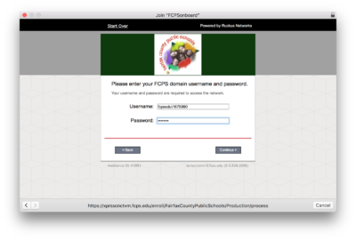

# Linux Wifi Setup

1. Connect to the FCPSonboard network
2. Open a web browser and navigate to fcps.edu
3. You should be redirected to a login website
4. Accept the terms

   

5. Select "FCPS Staff and Students"

   a. You could also sign in as a guest, that just changes the password you use in a later step.

   

6. Enter your FCPS Student ID and Password

   

7. Navigate to the "Other" network devices

   --PICTURE NEEDED--

8. Download the certificates

   --PICTURE NEEDED--

9. Now, navigate to your network manager.

   Click on the “Fairfax” wifi network in the list of networks. Enter the information in the box as shown.

   Make sure to select “TLS” as the authentication type and not “TTLS”.

   

10. If you are a cool person who uses `wpa_supplicant`, put this instead in your `/etc/wpa_supplicant/wpa_supplicant-<interface>.conf`

    ```text
    network={
    ssid="Fairfax"
    key_mgmt=WPA-EAP
    eap=TLS
    identity="guest@fcps.edu"
    # or,
    # identity="<your-id>@byod.fcps.edu"
    ca_cert="/etc/wpa_supplicant/wifi_certs/FCPS.pem"
    client_cert="/etc/wpa_supplicant/wifi_certs/user.crt"
    private_key="/etc/wpa_supplicant/wifi_certs/user.key"
    private_key_passwd="<guest password or your own password>"
    }
    ```

    a. FCPS.pem == The first CA certificate \(you don't need the websense one\)

    b. user.crt == `openssl pkcs12 -in certificate.p12 -out user.crt`

    c. user.key == `certificate.p12`

