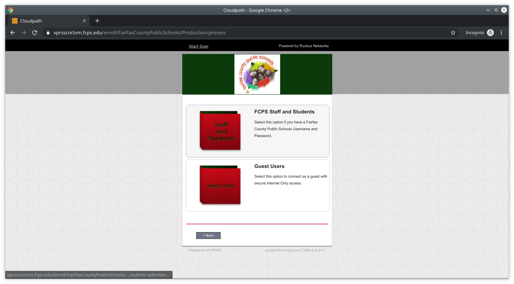
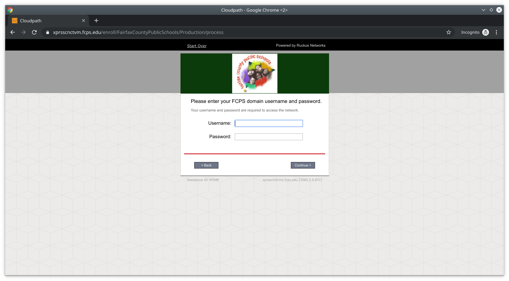
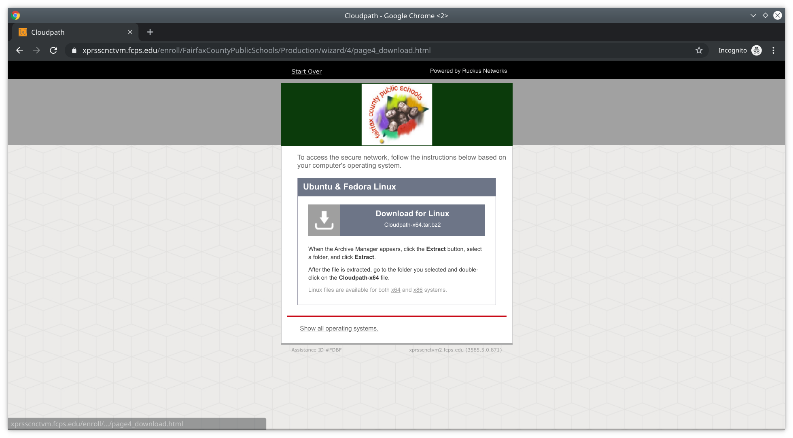
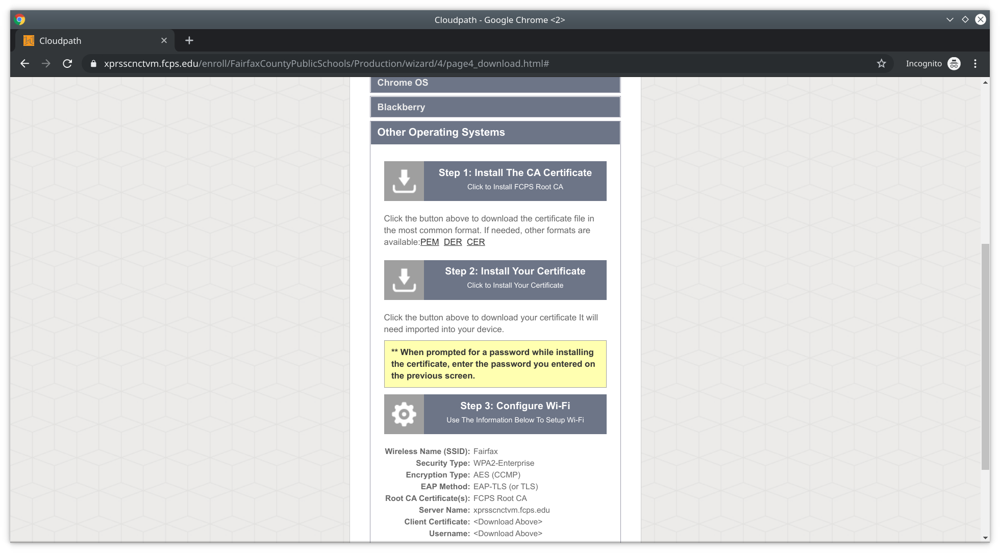
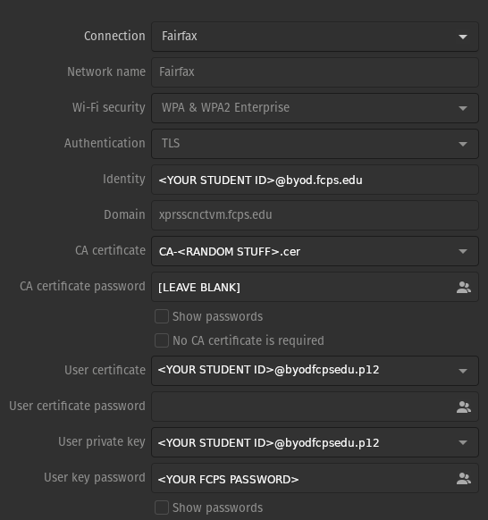

# Linux Wi-Fi Setup

Connect to the FCPSonboard network. Go to `http://www.neverssl.com` and you should see the FCPS Wi-Fi sign in page.

.png>)

Accept the terms, and click Start.

Select Staff and Students, and enter your FCPS Student ID as the username and your FCPS password (i.e. your Blackboard password) as the password.





You should see something like this. Select "Show all operating systems" at the bottom.



Scroll down and select Other Operating Systems.



Download both the CA certificate and the user certificate (step 1 and 2, respectively).

If you use `wpa_supplicant` to connect to Wi-Fi, first use `openssl pkcs12 -legacy -in certificate.p12 -out user.crt` to convert the user certificate into a different format compatible with `wpa_supplicant`. Then add the below in `/etc/wpa_supplicant`, using `identity="guest@fcps.edu"` if you used the Guest option, or `identity="<FCPS STUDENT ID>@byod.fcps.edu"` if you signed in with an FCPS ID, and substitute paths in for `ca_cert`, `client_cert`, and `private_key` for the FCPS CA, the user certificate generated by `openssl` above, and the user certificate you downloaded respectively. Reference [this](https://wiki.archlinux.org/index.php/WPA\_supplicant) for further information.

```
network={
ssid="Fairfax"
key_mgmt=WPA-EAP
eap=TLS
identity="guest@fcps.edu"
# or,
# identity="<FCPS STUDENT ID>@byod.fcps.edu"
ca_cert="/etc/wpa_supplicant/wifi_certs/FCPS.pem"
client_cert="/etc/wpa_supplicant/wifi_certs/user.crt"
private_key="/etc/wpa_supplicant/wifi_certs/user.key"
private_key_passwd="<guest password or FCPS password>"
}
```

Some desktop environments, GNOME below, allow you to configure this through built-in utilities. You can configure GNOME like this, with Identity being `<FCPS ID>@byod.fcps.edu`, the User Certificate and Private Key being the User CA you downloaded, the CA certificate being the CA certificate you downloaded, and the Private key password your FCPS password:



Note: As of somewhere around `NetworkManager` version 1.36.x (which ships by default in Ubuntu 22.04 LTS, Fedora 36, and probably some other major Linux distributions), `NetworkManager` will fail to connect if `Domain` is not properly set to `xprsscnctvm.fcps.edu` and will give **NO** helpful information about why.
