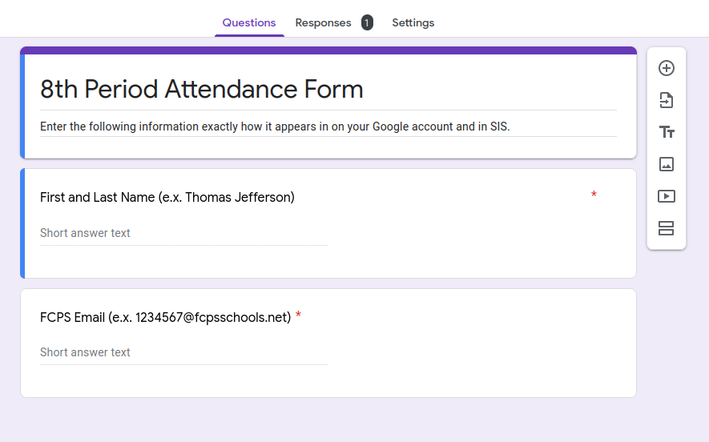
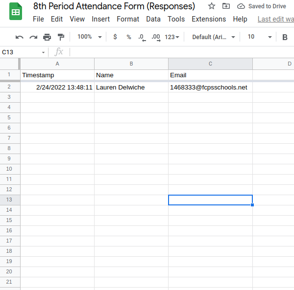
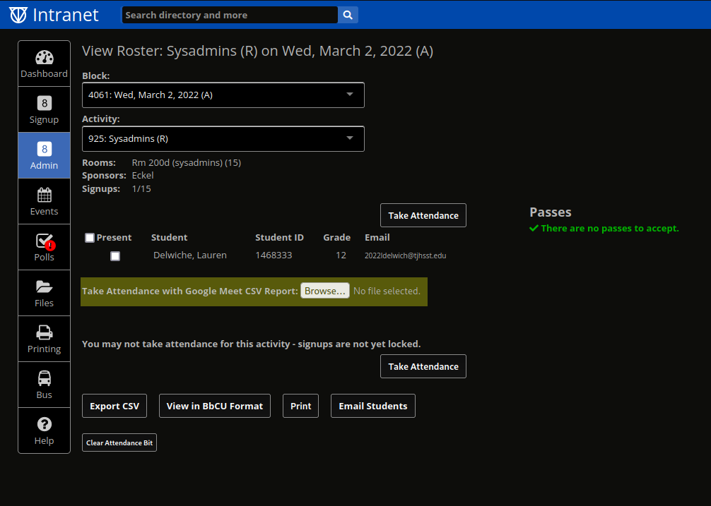

# Large Group Attendance

## Setup

You should create a Google Form using your FCPS Google Drive. The form needs to follow the exact format pictured below and both questions should be required.

Click through the Google Form to open the spreadsheet of responses. Your students' responses will populate here. You must change the column headers to "Name" and "Email" as shown below. Capitalization is important and this process will not work if you do not change the column names.

## During the Block

Post the link to the form you created. Make sure students know that they have to sign in with their FCPS emails to complete it and that they have to enter their first and last name as they appear in Ion. Additionally, emphasize that the email that they have to enter should be their @fcpsschools.net email.

## After the Block

Go back to the spreadsheet of responses and click File -> Download -> Comma separated values. Save the file where you will be able to find it later.

Then, go into the page on Ion where you usually take attendance and click "**Take Attendance with Google Meet CSV Report:**" Upload the spreadsheet file that you downloaded.

Ion will do the rest of the work and will check off the students that it finds in the uploaded file. It will notify you of any students that were in the form, but couldn't be found as a signup. This is probably indicative of a formatting error in the students' submission. You will still be able to manually check off students to rectify these issues.
