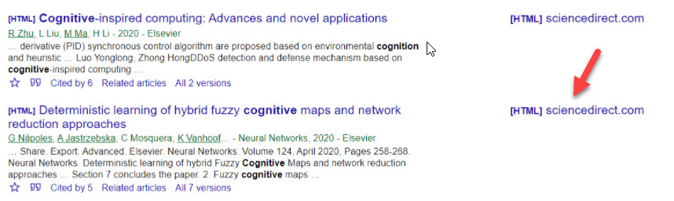

# CASA

### **What is CASA?**

CASA is a tool created by Google to allow students to access databases that TJ subscribes to while not on the TJ campus. Instead of using a proxy, CASA ties a token to your device when you access a database while on campus.

### **CASA Set Up**

**Step 1:** To initiate CASA you must be on campus and connected to the FCPS WiFi.\
**Step 2:** Use keywords to search and find an article through [Google Scholar](https://scholar.google.com/intl/en/scholar/help.html). You can select any article that is from a database to which the TJ library subscribes.\
**Step 3:** Click the link to access that article. CASA will record an affiliation between your device (laptop, mobile phone, desktop, etc.) and your institution (TJ). The full text article should open in a new window.

### CASA Use

The next time that you use the same device to visit Google Scholar - on or off campus - it will automatically allow you to access any articles that are from databases that TJ subscribes to. In addition, if you are signed in to your gmail account on the device that originally generated the token, gmail can port that token to any other devices (laptop, tablet, mobile phone, desktop, etc.) that are signed into the same gmail account.

### CASA Renewal

The off-campus access is valid for up to 120 days. To renew it, simply repeat the set up steps by visiting a database through Google Scholar while on campus again.
