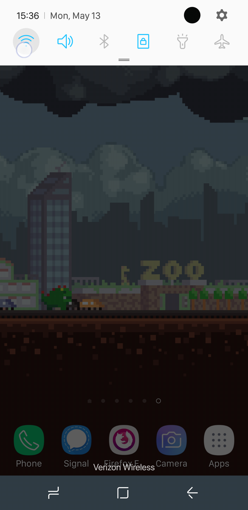

# Android


You MUST have set your Ion/CSL password before you can set up your TJ Proxy.


## Configure Proxy

Pull down the menu area and then long press the wifi symbol to access your wifi settings.

After that, long press the network you are connected to (Fairfax in this case) and then press manage network settings.

Press `Show advanced options`

Scroll down and then do the following:

1. Change the Proxy to Auto-config
2. Put in https://pac.tjhsst.edu in the PAC web address text field
3. Press connect

## Testing out the Proxy

Go to [https://sites.google.com/view/tjlibraryresources/ejournals-databases](https://sites.google.com/view/tjlibraryresources/ejournals-databases) to visit the library databases page.  If you are logged into your fcpsschools account on the browser you are using, go to [https://sites.google.com/fcpsschools.net/tjlibraryresources/databases-ejournals](https://sites.google.com/fcpsschools.net/tjlibraryresources/databases-ejournals)  Visit the Access Science page.

If you haven't logged in already, you will then see a login prompt like this.

If you have logged in successfully, you should see `Thomas Jefferson High School` after pressing the menu button.
