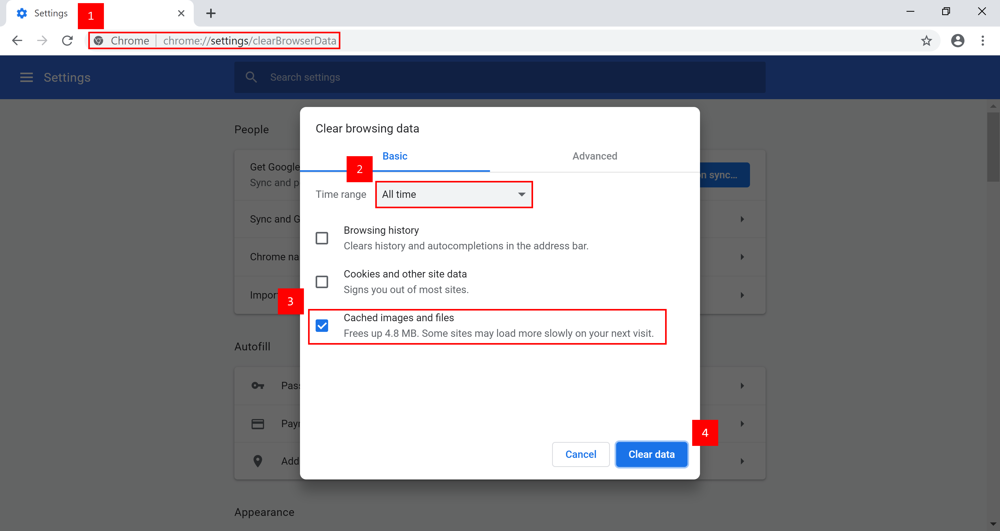
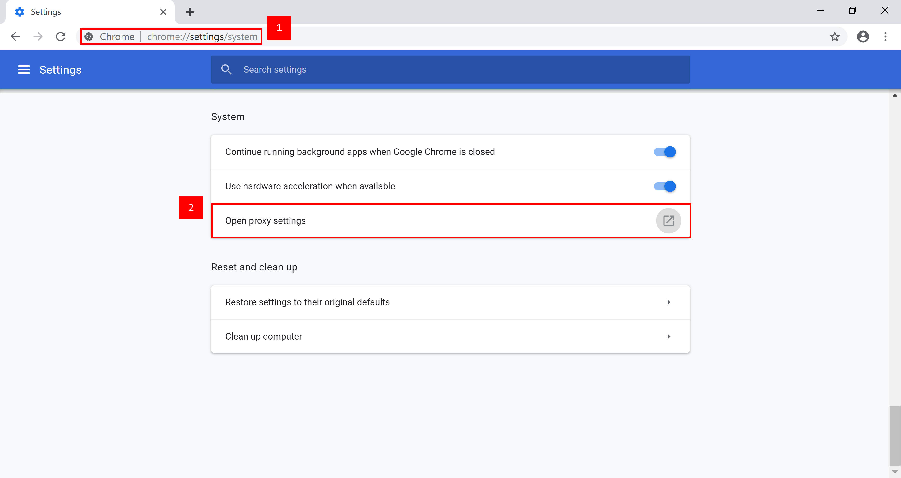

# Chrome


**DEPRECATED:** The tjCSL Library Proxy has been deprecated. The information on this site is preserved for documentation and historical purposes. Please check the Google CASA setup [here](../casa.md).



You MUST have set your Ion/CSL password before you can set up your TJ Proxy.


## Clear Cache

You need to clear your browser cache for the proxy to work.  Follow these instructions to do so.

1. &#x20;Enter `chrome://settings/clearBrowserData` into your search bar
2. Go to the basic tab and select `Cached images and files`
3. Select the `Clear Data` button.

## Configure Proxy

Follow the directions below to configure your proxy in Chrome.

1. Enter `chrome://settings/system` into your search bar
2. Select `Open proxy settings` and follow the specific instructions for your operating system.
3. Follow the specific instructions for your operating system to set up Automatic Proxy Configuration via the URL [https://pac.tjhsst.edu](https://pac.tjhsst.edu)


[macos.md](macos.md)



[windows.md](windows.md)


