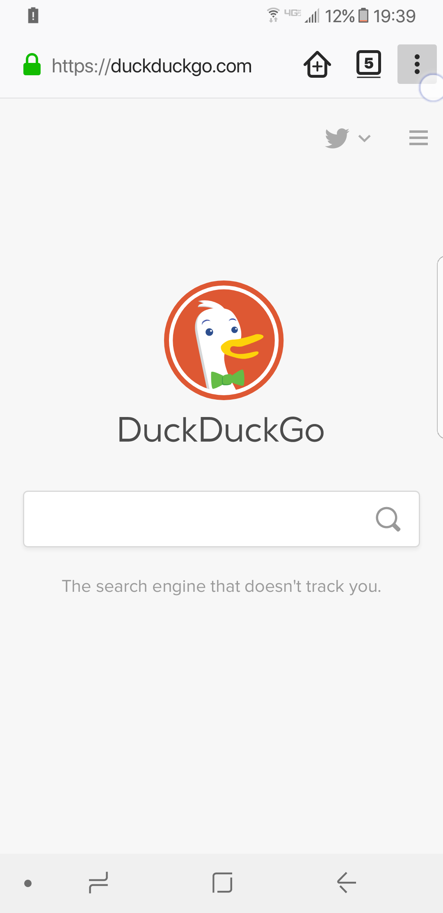
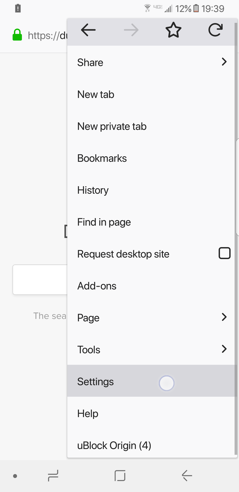
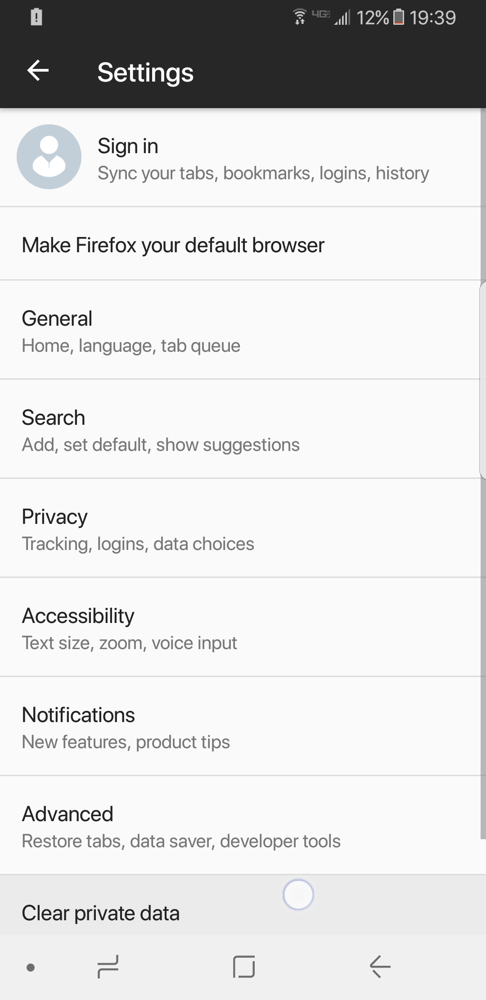
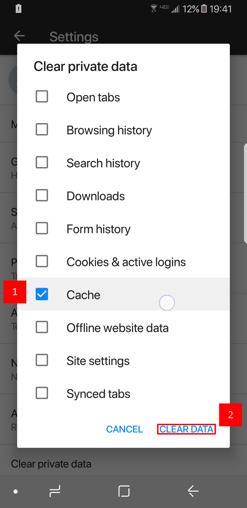
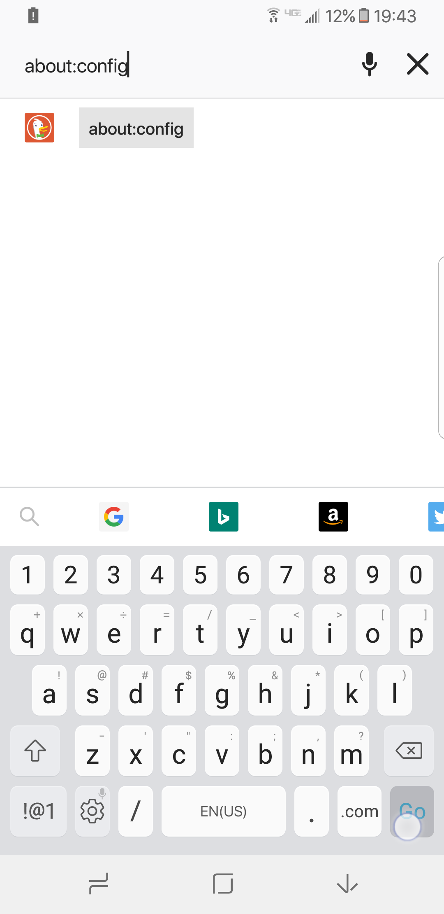
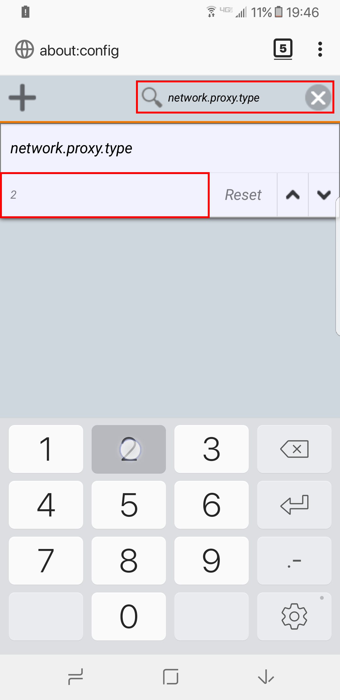
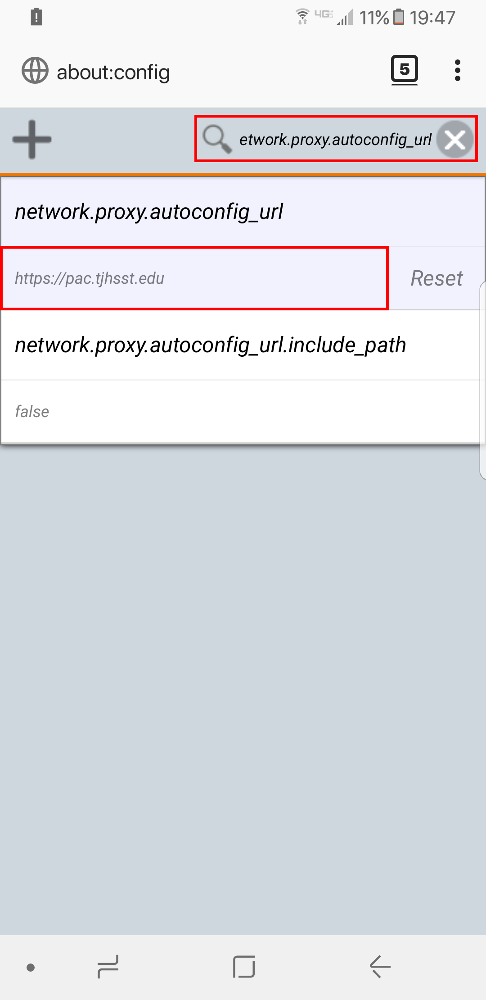
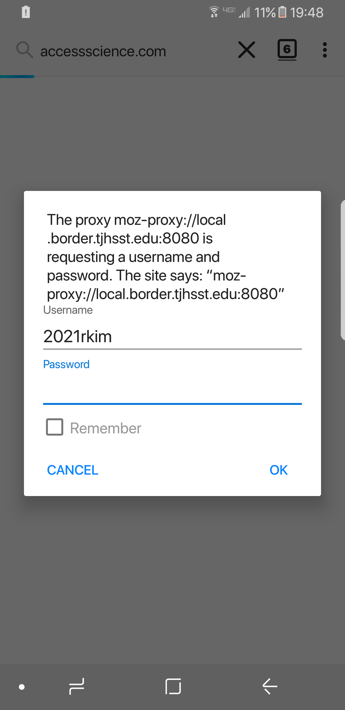
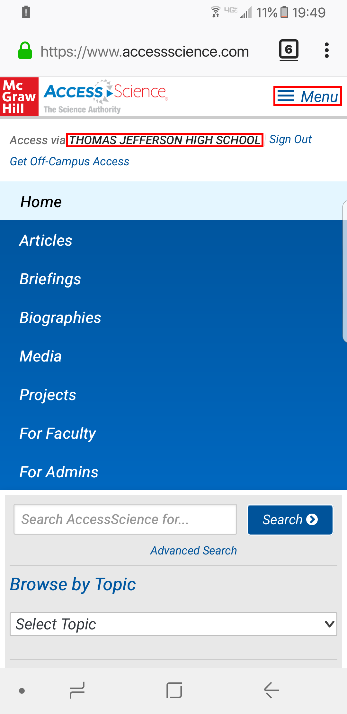

# Firefox for Android


**DEPRECATED:** The tjCSL Library Proxy has been deprecated. The information on this site is preserved for documentation and historical purposes. Please check the Google CASA setup [here](../casa.md).


For anyone wondering, yes, Firefox on Android is very different from desktop Firefox.  This is especially true for setting up the proxy.

## Clearing Cache

First, go to the menu by pressing the button with three vertical dots.

Then go to the settings.

On the settings page, select `Clear private data`.

Make sure that the cache option is checked and then select `clear data`.

Once you have cleared data, exit the settings screen and type in `about:config` in the address bar.

In this area, search for `network.proxy.type` and give it a value of 2.  This lets Firefox know that you want to use a pac file for your proxy.

Then search for `network.proxy.autoconfig_url` and set it to be `https://pac.tjhsst.edu`.

## Test it Out

To test this out, go to `accessscience.com`.  You should see a prompt for a username and password pop up.  When prompted, put in the login information you would use to access Ion.

When you reach Access Science, press the menu button or the three horizontal lines and you should see Thomas Jefferson High School

