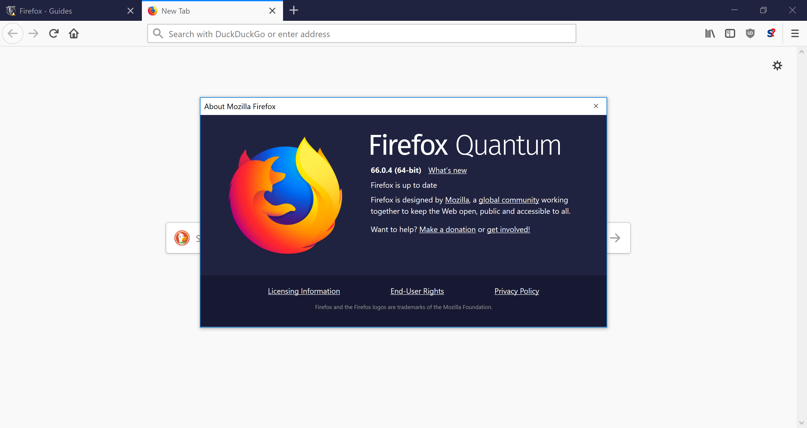
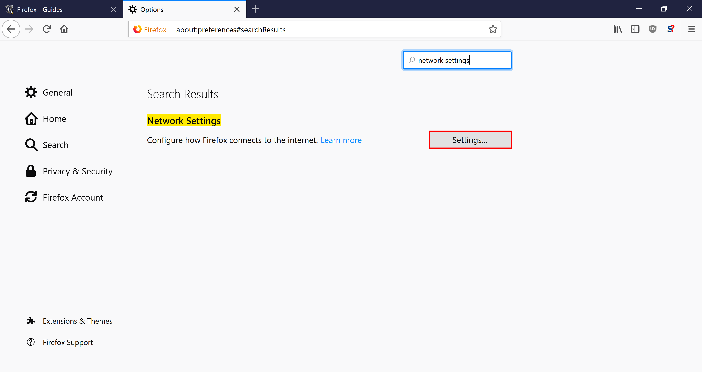

# Firefox


You MUST have set your Ion/CSL password before you can set up your TJ Proxy.


## Updating Firefox

This guide uses **Firefox Quantum (Firefox version 57.0 and above)**.  Menu designs changed and look very different from every version below that, so the guide will not accurately describe the steps you should take if your version is lower.

Steps to checking what version you have&#x20;

For Windows

1. Press `Alt`
2. Mouse over `Help`
3. Click `About Firefox`

For Macs

1. Click `Firefox` at the top left
2. Click `About Firefox`

If your About Firefox window shows Firefox Quantum, you have a late enough version.  Otherwise, you will need to use this menu to restart and update Firefox until the About Firefox window shows Firefox Quantum.

## Clearing Cache

Follow the instructions/screenshots below to setup your proxy:

Open the menu by clicking the three bars at the top-right and click on `Options`

Locate the search bar to the top right of the screen.

Search `clear history` and select the `Clear History` button.

1. Change the time range to `Everything`.
2. Make sure that `Cache` is selected under the History header
3. Select `Clear Now`.

## Configure Proxy

Now, search `Network Settings` and select `Settings`.

1. Under the Configure Proxy Access to the Internet header, select `Automatic proxy configuration URL`.
2. Put `https://pac.tjhsst.edu` in the text field below.
3. Select `Reload` and then `OK`.

## Test it Out

Navigate to the Library Databases page a [https://sites.google.com/view/tjlibraryresources/ejournals-databases](https://sites.google.com/view/tjlibraryresources/ejournals-databases).  Under the Science Databases, select `Access Science`.

If the link provided showed up a s a 404, you are probably logged into your fcpsschools account.  Try [https://sites.google.com/fcpsschools.net/tjlibraryresources/databases-ejournals](https://sites.google.com/fcpsschools.net/tjlibraryresources/databases-ejournals) instead.


You may be presented with a password prompt. If so, type the username and password you use to log in to Ion.


Once you have successfully authenticated, you should see `Access via Thomas Jefferson High School` at the top right of the site.

If you encounter any issues while setting up the proxy, please see [Troubleshooting Proxy issues](troubleshooting-proxy-issues.md).
