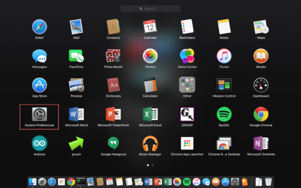
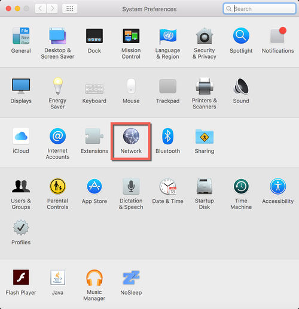
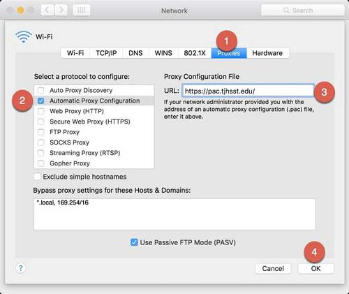

# Mac OS X


**DEPRECATED:** The tjCSL Library Proxy has been deprecated. The information on this site is preserved for documentation and historical purposes. Please check the Google CASA setup [here](../casa.md).



You MUST have set your Ion/CSL password before you can set up your TJ Proxy.


## Configure Proxy

Follow the screenshots below to configure your proxy on Mac OS X.

* Open "System Preferences"

* Click on "Network"

* Click on "Advanced"
* Choose the "Proxies" tab
* Select "Automatic Proxy Configuration"
* Enter `https://pac.tjhsst.edu`

* Click "OK"

## Help

If you encounter any issues while setting up the proxy, please see [Troubleshooting Proxy issues](troubleshooting-proxy-issues.md).

