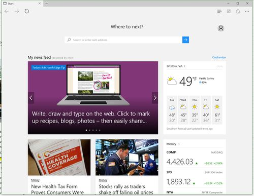
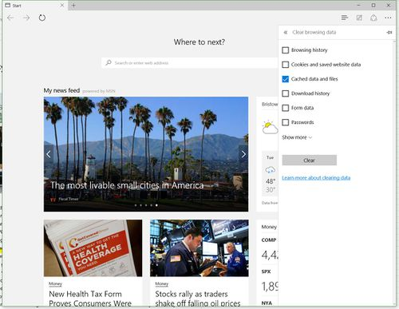
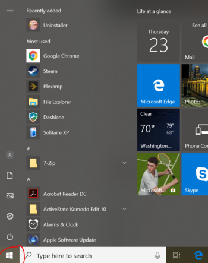
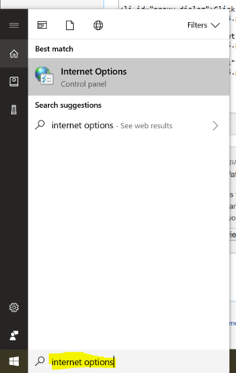
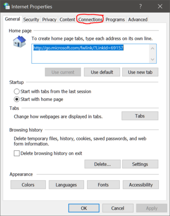
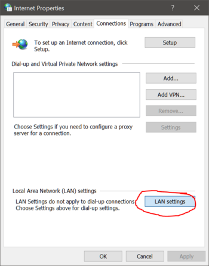
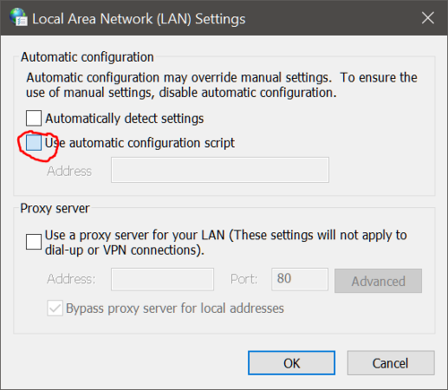
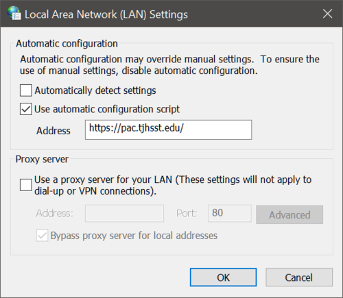
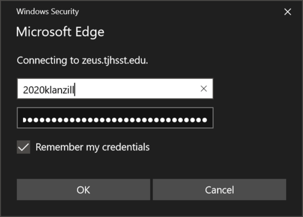

# Windows


**DEPRECATED:** The tjCSL Library Proxy has been deprecated. The information on this site is preserved for documentation and historical purposes.



You MUST have set your Ion/CSL password before you can set up your TJ Proxy.


## Clear Cache

Follow the instructions to clear your Edge cache.

* Open Edge.

* Click the menu button (three dots, horizontally).

.jpg>)

* Click "Settings".

.jpg>)

* Click "Choose what to clear".

* Make sure "Cached date and files" is checked. You may wish to uncheck the other unboxes.

* Click "Clear."

## Configure Proxy

Follow the screenshots below to configure the database proxy on Windows.

* Click the Start menu icon. The Start menu appears

* In the search field, search "internet options" and click on the first result

* A window will open. Choose the "Connections" tab

* In the "Connections" tab, click on "LAN Settings.

* In the "LAN Settings" popup, check the box "Use automatic configuration script

* In the "Address" field, type [`https://pac.tjhsst.edu/`](https://pac.tjhsst.edu/)

* Click "OK" and then "OK" again.

## Test It Out


You MUST use the database link provided at [https://sites.google.com/view/tjlibraryresources/ejournals-databases](https://sites.google.com/view/tjlibraryresources/ejournals-databases)


* Open Edge
* Navigate to the Library Databases page and click "Access Science".

.PNG>)

* You may be presented with a password prompt.  If so, type the username and password you use to login to Ion.


If this is the first time you have connected to the proxy and do not see an authentication prompt, please ensure that you have completed the steps under "Clear Cache".


* If you see the words "Thomas Jefferson High School", you have correctly set up the database proxy.

## Help

If you encounter any issues while setting up the proxy, please see [Troubleshooting Proxy issues](troubleshooting-proxy-issues.md).
