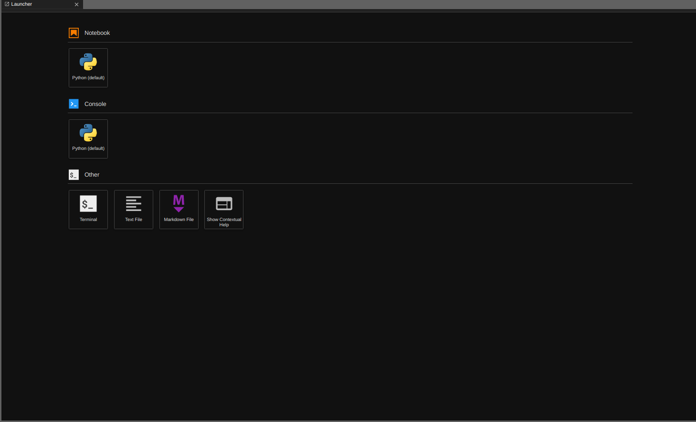
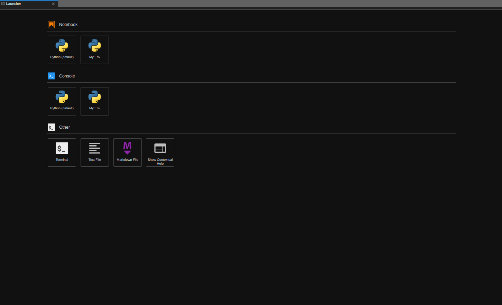

# Open OnDemand

## What is Open OnDemand?

[Open OnDemand](https://openondemand.org/) is how you can access TJ's Cluster. It contains many different applications within it, including JupyterLab, a fully-online IDE that is very similar to Google's Colab interface. Additionally, it also contains other IDEs for other programming languages, including RStudio for R, a MATLAB setup, and even a fully online VS Code via Codeserver!

## How do I open an Application?

TJ's OnDemand instance is available at[ https://jupyterhub.tjhsst.edu](https://ondemand.tjhsst.edu/). The first time you load the page, it may take a minute or two, and you will be redirected to Ion to authenticate. Then you will be presented with a screen that looks like this:

<figure><figcaption></figcaption></figure>

Here, choose the application you want. In the following, we assume you choose Jupyter Lab. You should then be asked for a Job Profile, with the following options:

* Default (4 CPUs, 8GB RAM)
* Compute (8 CPUs, 16GB RAM)
* 1 GPU (8 CPUs, 16 GB RAM, 1 GPU)
* 2 GPUs (8 CPUs, 16 GB RAM, 2 GPUs)
* 4 GPUs (8 CPUs, 16 GB RAM, 4 GPUs)

Please only choose what you need. Depending on usage, it may take longer to spawn instances for higher resource allocations, and others may be prevented from using resources allocated to you if you are not using them.

You will then be placed in a queue to wait for your own server to spawn. Our instance is configured such that your server may be spawned on one of 53 different machines. Even though your server is spawned on random machines, all your files are stored in a common location:  `/csl/useres/<username>`.&#x20;

The page will automatically update and show you the following screen once it has loaded:

<figure><figcaption></figcaption></figure>

At this point, click on the blue "Connect to Jupyter" button to start the Jupyter Lab session.

## Advanced Features

### Python Interfaces

After logging in, you may be greeted with a "Launcher" tab. This tab will have multiple options, including:

* Python Notebook
* Python Console
* Terminal

The Python Notebook and Python Console are two separate interfaces, and you may experiment with either of them.&#x20;



Both of these Python interfaces are based in the "default" Python environment, meaning they have the default packages. In most cases the default packages will suffice, but if you need to install custom packages read the [#creating-pixi-environments](./#creating-pixi-environments "mention") sections.&#x20;


### Activating Ready-made Environments

The (amazing) Sysadmins provide everyone with a set of predefined environments on the launcher for different purposes (e.g. Physics, Quantum Computing, Computer Vision, etc). To activate these environments while using the terminal, you must run the following command:

```bash
module load <name of environment>
```

Note that `<name of environment>` should be replaced with the name of an environment. For example, to activate the physics environment, run:

```bash
module load physics
```

To see a list of all available modules, run:

```bash
module avail                       # see all available modules
module show <name of environment>  # more details information about a specific module
```

To undo the loading of a module, simply run:

```bash
module unload <name of environment>
```

### Creating Pixi Environments

Both the Python Notebook and Console are backed by [Pixi](https://pixi.sh/latest/) environments. Familiarize yourself with Pixi environments before reading on. If you're familiar with `conda`  environments, Pixi is a faster conda with more features.

To create a personal custom Pixi environment, do the following: on `infoprism` or any cluster node run the following in your home directory (`/csl/users/<your_csl_username>`)

```bash
pixi init my_personal_environment
cd my_personal_environent
pixi add ipykernel "python>=3.13"
```

`my_personal_environment` can be replaced with whatever you want.

After creating the Pixi environment, activate it:

```bash
pixi shell
```

Finally, add the environment to JupyterLab:

```bash
python3 -m ipykernel install --user --name "my_env" --display-name "My Env"
```

The `--name` and `--display-name` parameters can be anything you wish.

After running the previous commands, your launcher should now look like this:



Now you have created a personal environment you have total control of. You may use `pixi` to install any custom packages you wish. Be sure to click on your new Python Notebook/Console option (not the default option) if you wish to access your custom environment.

### Removing Environments


Removing environments is a permanent action and cannot be reversed!


Removing the Pixi environment is simple:

```bash
rm -rf /csl/users/<username>/my_personal_environment
```

Removing the entry is a little more involved:

```bash
rm -r /csl/users/<username>/.local/share/jupyter/kernels/<name>
```

* The `<name>` parameter must match the `--name` parameter passed to the `python -m ipykernel ...` step, **NOT --display-name**! You may also `ls` around in this directory to find your matching environment and then `rm -r` the directory
* After removing the directory, reload JupyterHub and the entry will now be removed.
