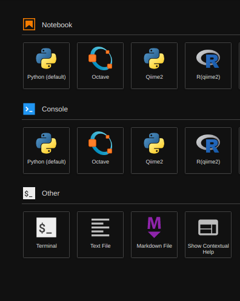

# QIIME2

## Disclaimer

Before working with JupyterLab and the Cluster, it is **highly** recommended that you read all the previous articles on the [Cluster](../cluster-introduction.md), [Slurm](../using-infoprism.md), and [OnDemand](./). Running into the Cluster without knowing how the various features work will not be an enjoyable experience for you.

## Running Qiime2

### Logging in&#x20;

1. Create a JupyterLab session on OnDemand (see [OnDemand](./))
2. You will be placed into a queue until a computer is allocated to you (one of 40+ machines)
3. Once logged in, select "File > New > Terminal" this will give you a terminal on the machine you are n
   * This is the same effect as Running `ssh [Ion username]@remote.tjhsst.edu` and then `ssh [computer]` from there.

### Activating qiime2

`qiime2` and related packages are installed in the `qiime2` module. This environment can also be accessed through JupyterLab with the "Console" and "Notebook" options (Python only). To access `qiime2` from the terminal run the following:

```bash
module load qiime2
```

Now you can run `qiime` to access Qiime2

### Qiime2 Through JupyterHub

After logging into JupyterHub you should see the following on the JupyterHub "launcher":



The `qiime2` options will spawn a Python Notebook or Console depending on what you choose. The `R(qiime2)` will spawn an R Notebook or Console depending on what you choose.
