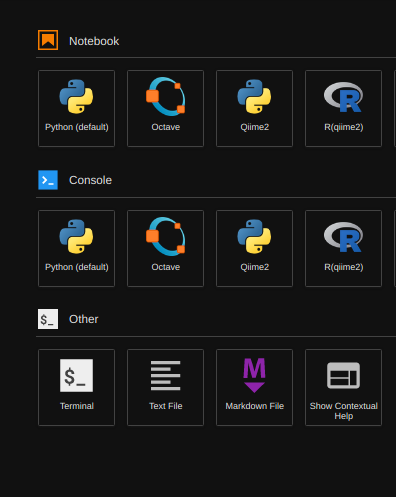

# QIIME2

## Disclaimer

Before working with JupyterLab and the Cluster it is **highly** recommended that you read all the previous articles on the [Cluster](../cluster-introduction.md), [Slurm](../using-infoprism.md), [JupyterHub](./), and [Conda](../using-zoidberg.md#conda), (official conda docs [here](https://docs.conda.io/en/latest/)). Running into the Cluster without knowing how the various features work will not be an enjoyable experience for you.

## Running Qiime2

### Logging in&#x20;

1. Log into [https://jupyterhub.tjhsst.edu](https://jupyterhub.tjhsst.edu) through Ion
2. You will be placed into a queue until a computer is allocated to you (one of 40+ machines)
3. Once logged in select "File > New > Terminal" this will give you a terminal on the machine you are n
   * This is the same effect as Running `ssh [Ion username]@remote.tjhsst.edu` and then `ssh [computer]` from there.

### Activating Conda

Conda is a package manager that has been installed on these servers. It creates environments in which you can run and install software. You need to initialize conda once for your user account before you can access the qiime2 installation.

* If you have never run `conda` before run: `/opt/conda/bin/conda init bash && source ~/.bashrc`

### Activating qiime2

`qiime2` and related packages are installed in the `qiime2` conda environment. This environment can also be accessed through JupyterHub with the "Console" and "Notebook" options (Python only). To access `qiime2` from the terminal run the following:

```bash
conda activate qiime2
```

The terminal prompt should now look something like this (noticed the `(qiime2)` preceding):

```
(qiime2) borg40 2021abagali $
```

Now you can run `qiime` to access Qiime2

### Qiime2 Through JupyterHub

After logging into JupyterHub you should see the following on the JupyterHub "launcher":



The `qiime2` options will spawn a Python Notebook or Console depending on what you choose. The `R(qiime2)` will spawn an R Notebook or Console depending on what you choose.
