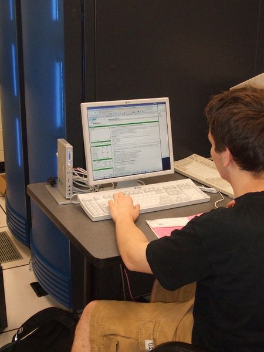
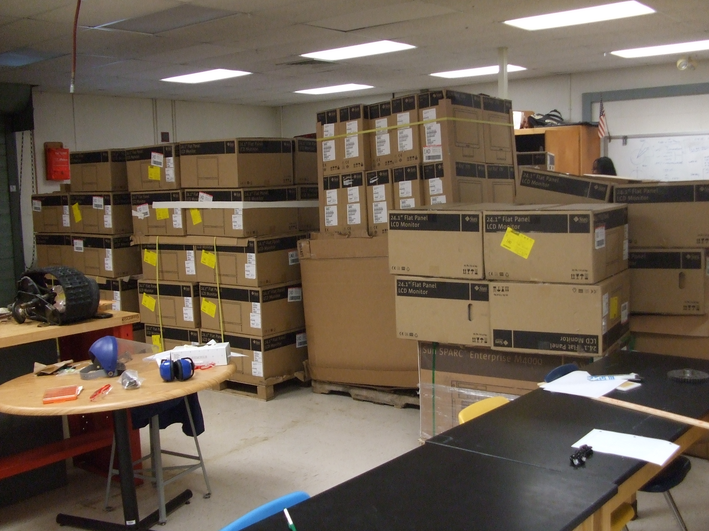
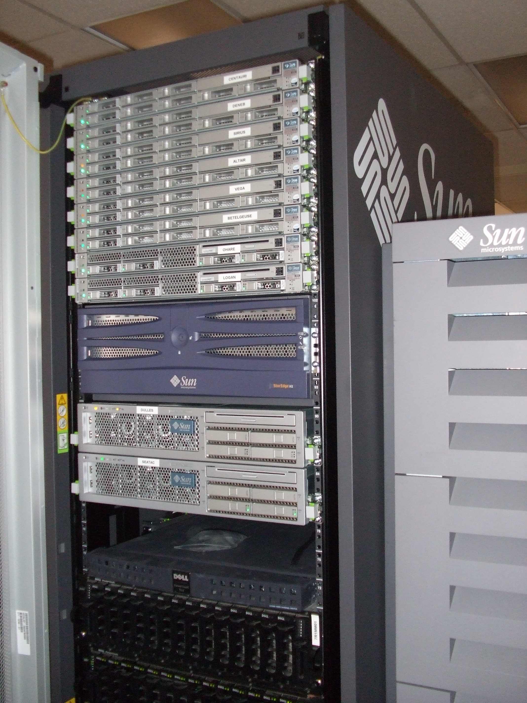
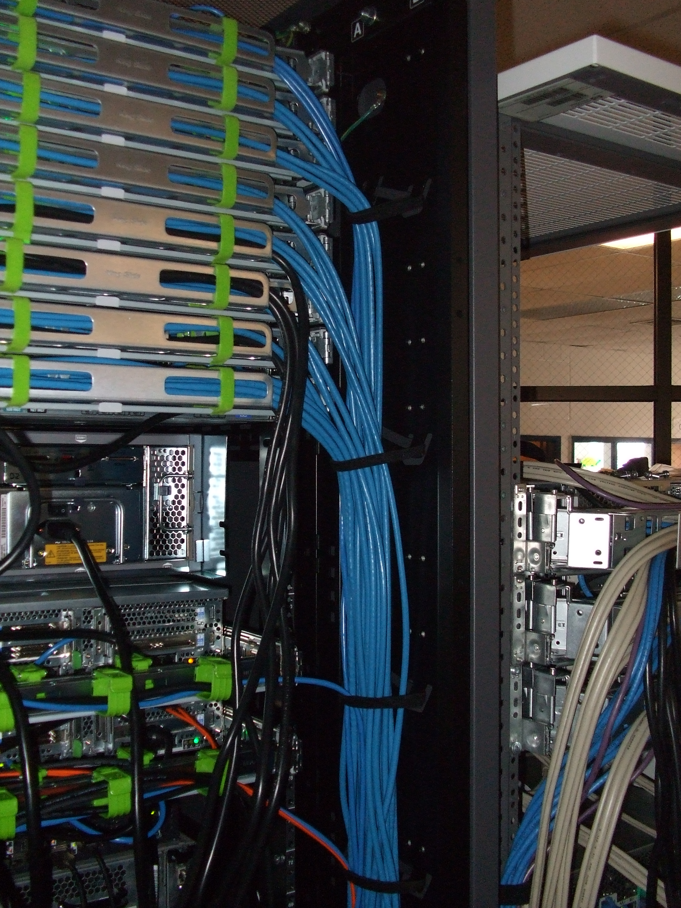

# 2008 Sun AEG

The CSL received various items in 2008 as part of Sun's Academic Excellence Grant (AEG).  Various pieces of equipment are currently being used in various locations within the SysLab; however, the Sun Ray clients have been since decommissioned and are no longer deployed.

<figure><figcaption>
Sun Ray console in the Syslab's machine room - June 2008
</figcaption></figure>

 

<figure><figcaption>
"Music Cart" using a SunRay 2FS
</figcaption></figure>


The below information is imported from Livedoc and has been edited to reflect the current state of affairs.  The locations/purposes/uses of the below equipment has changed dramatically since 2008. Information stated here are for historical purposes.


## History

Through the Sun Academic Excellence Grant program, the Computer Systems Lab deployed new Sun Ray thin clients in addition to refreshing AP Computer Science Lab 231. These stations were for students. The Sun Ray 270s were placed throughout the school to be used by students, faculty, and guests as kiosks. Smart Cards were distributed to students by request for ease of use with Sun Ray clients.

Most servers were used to power the Sun Ray backend. One SPARC server was used as a supercomputing system. Other servers ran backend services.

The overall value of the grant equipment (tax exempt) is $388,048.00. Shipping will also be covered by Sun, which is an estimated value of $5978.70.

### FY08Q2

(awarded 12/29/2007)

#### Events

<figure><figcaption>
Piles of Sun boxes appeared in the Energy Systems lab
</figcaption></figure>

* **2008/09/01:** Sun Ray 270s are added to TJ's cafeteria. There are six in the cafeteria, and more are expected to be added throughout the school. These areas will include the auditorium lobby and senior hall.
* **2008/07/28:** All biology and chemistry classrooms now have at least one Sun Ray. All foreign language classrooms also now have at least one Sun Ray. Other various teachers have also requested stations for their classrooms.
  * 16 of 20 Sun Ray 2FS units have been deployed (the remaining 4 are already reserved for deployment or as spares).
  * All 100 Sun Ray 2 units have been deployed or reserved as spares.
  * Sun Ray 1 units from the old AEG are being redeployed to meet demand.
  * Four X4150s now drive the primary Sun Ray FOG.
  * AMGH has been fully configured to allow hotdesking between production, testing, and HPC FailOver Groups using smart cards.
  * Home users can now use the built-in IPSec VPN client; we've implemented a compatible solution without buying expensive Cisco hardware!
* **2008/06/16:** Network and power wiring for servers is finalized. Three X4150s are currently in production for approximately 75 Sun Rays deployed throughout the school. Sun Rays have been set up in most biology and chemistry labs, the AP Computer Science lab, about half of the Senior Research Laboratories, in various locations as teacher workstations, and are being installed in all Foreign Language rooms and various other classrooms. Mirror (Seatac, V245) has been set up and is currently syncing several distributions of Linux and some Sun-related repositories. Mirror (Seatac) syncs most repositories from GTlib. Arcturus (M4000) has been set up as a Sun Ray server in a separate FOG for high-performance computing, initially for the use by the Computer Systems Lab for supercomputing applications, the Neuroscience Lab for neuroimaging, and labs interested in using Matlab. Betelgeuse (X4150) has been set up in a separate FOG to test new software and firmware updates before they are applied to the production Sun Ray servers.
* **2008/04/18:** Network and power wiring for servers are being finalized. Production infrastructure for Sun Rays is in place. Training is also occurring in parallel; pending completion of in-house training, additional servers will be added to the Sun Ray backend pool. Backend services are almost completely migrated off of old Sun hardware. Thin client installation is on-going in senior research labs (already completed swap-out in 231; fate of old stations TBD).

#### Grant Authors

* William Yang (Primary author)
* Stephen (Trey) Repetski

<figure><figcaption>
Sun servers acquired through the Sun AEG Program
</figcaption></figure>

 

<figure><figcaption>
Backside of the new Sun rack
</figcaption></figure>

#### Items

* 1 Sun SPARC Enterprise M4000 (4x2.15 GHz SPARC64-VI dual-core processors (2 CPU boards with 2 CPUs each & 5MB on-chip L2 cache), 16GB RAM (2 memory modules with 8x1GB DDR2 DIMMs each), 2x73GB SAS hard disks)
* 6 Sun Fire X4150 (2x3.16 GHz Intel Xeon X5460 quad-core processors, 24GB RAM (12x2GB DIMMs), 2x73GB SAS hard disks)
* 2 Sun SPARC Enterprise T5120 (1x1.2 GHz UltraSPARC-T2 4-core processor, 8GB RAM, 4x146GB SAS hard disks)
* 2 Sun Fire V245 (2x1.5 GHz UltraSPARC-IIIi processors, 4GB RAM, 2x73GB hard disks)
* 1 Sun Fire V215 (1x1.5 GHz UltraSPARC-IIIi processor, 2GB RAM, 2x73GB hard disks)
* 4 PCIe Dual Ultra320 SCSI HBAs
* 100 Sun Ray 2 (including Type 7 Sun PC Keyboard/Mouse, 17" monitor)
* 20 Sun Ray 2FS (including Type 7 Sun PC Keyboard/Mouse, 2x24.1" monitors)
* 25 Sun Ray 270 (including Type 7 Sun PC Keyboard/Mouse, 17" monitor integrated)
* 4 Sun Ultra 45 (2x1.6 GHz UltraSPARC-IIIi processor, 2GB RAM, 2x250GB hard disks, 24.1" monitor, XVR-2500, XVR-300, DVD-Dual, Keyboard/Mouse)
* 3 Sun Ultra 24 (3.00 GHz Intel Core2 Extreme QX9650 quad-core processors, 2GB RAM, 250GB hard disk, 24.1" monitor, NVidia Quadro FX5600, NVidia Quadro FX570, DVD-Dual, Keyboard/Mouse)
* 145 Sun Ray Software RTU Licenses
* 2500 Payflex Smartcards with Sun artwork (100 packs of 25)
* 1 Sun Rack 1000-42 (PDS option)
* 4 VHDCI/VHDCI 2m SCSI cables
* 2 HD68/VHDCI 4m SCSI cables
* 4 HD68/VHDCI 2m SCSI cables

### FY02?


Information on this AEG is incomplete.


### Items

* Sun Enterprise 450 (4x400MHz UltraSPARC-II processors, 4GB RAM, 4x36GB hard disks, integrated+2 PCI 10/100 Ethernet, Sun PGX64 graphics accelerator, 17" CRT monitor, Keyboard/Mouse)
* 15 Sun Ray 100 (including Type 6 Sun PC Keyboard/Mouse???, 15" CRT monitor integrated)
