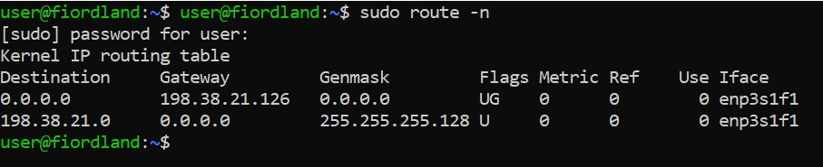

# Network Configuration

Now that there's a working install of Ubuntu on the server \(if not, see [Setting Up the Operating System](setting-up-the-operating-system.md)\), it's time to configure the network.

## Plug Stuff In

Software doesn't work all that well when the corresponding hardware isn't attached, so that's a good first step to take. Plug a blue cable into one of the two Ethernet ports on the server, and a red cable into the iLO port. The other end of the blue cable should go to one of the ports on the switch \(we'll be using port 4\) and the other end of the red cable should go to a different port on the switch \(e.g. port 1\).

## Set the IP Address

Now it's time to set the Internet Protocol \(IP\) address. On the server, type `ip addr` to see the different network interfaces. If the Ethernet is plugged into port 2 on the server, then the corresponding interface should be `enp3s1f1`. If it's plugged into port 1 on the server, then the corresponding interface is `enp3s1f0`. 

After that, execute these commands \(assuming `enp3s1f1`\):

* `ip link set dev enp3s1f1 up` - Activates the connection on `enp3s1f1`.
* `ip addr add 198.38.21.113/25 dev enp3s1f1` - Assigns an IP address of `198.38.21.113/25` to `enp3s1f1`. If it doesn't work, execute `sudo !!`.

### What's With All These Numbers?

The specific IP address of the server can be broken down into four parts:

1. `198.38` - This first part is the CSL network ID.
2. `21` - this represents the Understudy VLAN \(see [VLANs](../../mapping/vlans.md) for more information\).
3. `113` - this could be any number between 0 through 127, inclusive, except 126 \(which is the gateway IP address\).
4. `/25` - this creates a subnet that limits the size of the network to 128 addresses.

## Route the System

The server has an address now, but it doesn't know where anything is, which is where routing comes into play. Routing tells the server what it's looking for on the network.

Run `sudo route -n` to view the routing table. It should look like this:



If you're missing one or both of these, the syntax is `sudo route -net Destination gw Gateway netmask Genmask dev Iface`, where `Destination`, `Gateway`, `Genmask`, and `Iface` are replaced with their specific values shown in the picture. 

## Netplan

### What is Netplan?

For Ubuntu 18.04, Canonical decided to try something new with network configuration. Gone wre the days of adding stuff in different places. Now all you needed was a single \(or multiple\) YAML file with all your config stuff. This system was named Netplan, and it is the default network configuration system on Ubuntu 18.04.

Run `sudo nano /etc/netplan/01-netcfg.yaml` to edit the Netplan configuration. Then just copy-paste the following:

```text
network:
   version: 2
   renderer: networkd
   ethernets:
     enp2s0f0:
       addresses:
         - 198.38.21.110/25
       gateway4: 198.38.21.126
       nameservers:
               addresses: [198.38.16.40, 198.38.16.41]
               search: [tjhsst.edu]
```

Remember to define the correct network interface and IP address.

  


