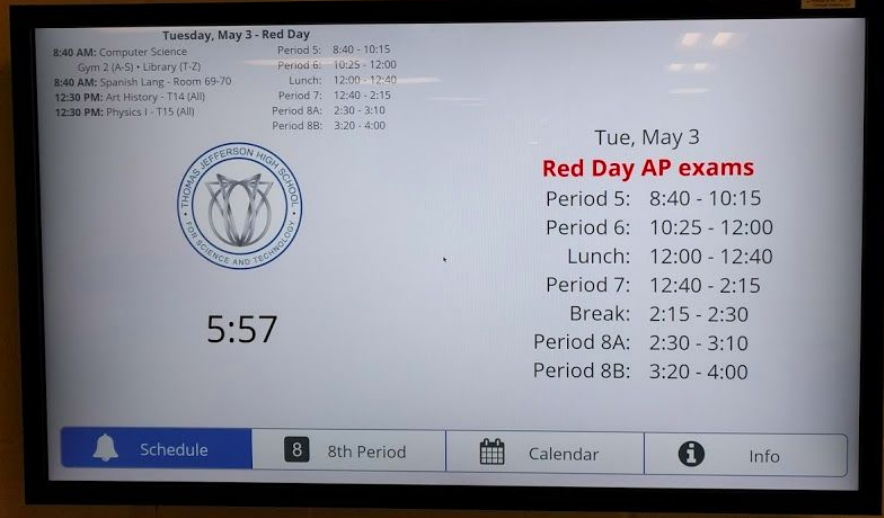

# Signage

**Signage** refers to the set of ten electronic displays located all over the school. A "Signage" refers to a display that displays useful information maintained by the CSL across the school.

Currently, each Signage display shows:

* a schedule
* a map of school
* announcements
* a bus map

The Signage displays also can show special event information.

The latest version of Signage is **Signage3**.

The core of Signage runs on Intel Compute Sticks \([official website](https://www.intel.com/content/www/us/en/products/boards-kits/compute-stick.html)\) running Ubuntu 16.04 LTS.

## History

### Signage1

The first Signage displays were installed around the first release of Ion \([source](https://tjhsst.edu/~jwoglom/ion.pdf)\) \(around May 2016\). They were originally developed as a complement to Ion. These efforts were led by James Woglom. The Signage displays ran on a mixture of Raspberry Pi 1s, Raspberry Pi 2s, and Raspberry Pi 3s.

### Signage2

Development of Signage2 began in April of 2017 to serve as a rewrite of Signage1 using Python's Kivy framework. Various limitations imposed by Kivy and slow performance led to the end of development around March of 2018.

_Image omitted because Kivy is bad_

### Signage 3

Development of Signage3 began in March of 2018 to serve as a rewrite of Signage as a webpage hosted on Ion. Signage3 was deployed on newly-arrived Intel Compute Sticks on April 12, 2018. Signage3 remains the current Signage deployed throughout the school.

## List

The current deployed Signage displays are named (and located):

* cs-nobel (Nobel commons)
* cs-curie (Curie commons)
* cs-galileo (Galileo commons)
* cs-cafeteria (Cafeteria)
* cs-gandhi-a (Ghandi commons)
* cs-audlob (Outside the audlob)
* cs-library (Library hallway)
* cs-hopper (Hopper commons)
* cs-cafe (Cafe commons)
* cs-einstein-a (Einstein commons)

## Current Setup

Each Signage display has their own Intel Compute Stick which runs Ubuntu Server 16.04 LTS. Using getty, each Signage display logs in as `user` and opens up a specific web page on Ion \(`https://ion.tjhsst.edu/signage/display/<display_name>`\) in Chromium. The Signage pages can be rendered server-side or as iframes. The code for Signage can be found [here](https://github.com/tjcsl/ion/tree/master/intranet/apps/signage).

