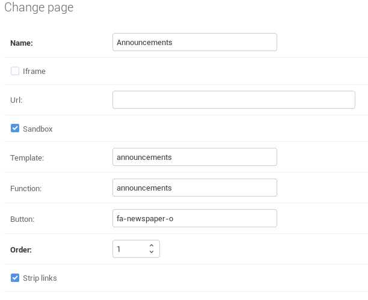
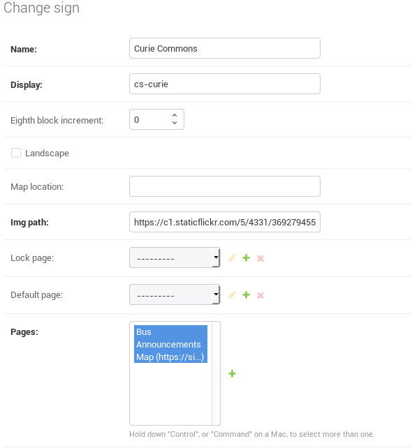

# Administration

## Sign/Page Administration

### Develop New Page

Views for each Signage page are located in the [pages.py code](https://github.com/tjcsl/ion/blob/master/intranet/apps/signage/pages.py). To add a new page, define the context in `pages.py`. The template should be defined in `templates/signage/pages/<page_name>.html`.

### Create New Page

Each Signage display renders multiple pages. Each page is defined within a `Page` model. Within Django admin, define the:

* name: Some descriptive name to represent the Page \(required\)
* template: The location of the template \(`templates/signage/pages/<template>.html`\)
* function: The function defined in `pages.py` for server-side rendering of context \(e.g. `hello_world`\)
* button: The name of the font-awesome icon to be used on the navigation bar \(e.g. `fa-bus`\)

The other fields can be left at their defaults.

Example:

The example Page shown above is named `Announcements`.

* Since we want the page to be rendered server-side \(not as an iframe\), the `iframe` box is not checked. 
* Since the page is not an iframe, we leave the `url` field as is.
* Since the page is not an iframe, we can leave the `sandbox` checkbox as is \(for more information about sandboxes read [https://developer.mozilla.org/en-US/docs/Web/HTML/Element/iframe\#attr-sandbox](https://developer.mozilla.org/en-US/docs/Web/HTML/Element/iframe#attr-sandbox)\).
* The `template` field is set to `announcements`, meaning that Ion will try to render `templates/signage/pages/announcements.html`.  
* The `function` field is set to `announcements`, meaning that Ion will use the `announcements` function in `pages.py` as context.
* The `button` field is set to `fa-newspaper-o`, meaning that this Font Awesome icon will be used in the navigation bar.  
* The `order` field is set to 1, meaning that the button is second on the navigation bar.  The pages should be ordered as you want them to appear on the bar \(required\).
* The `strip_links` field is checked off because you should not be able to navigate off a page by clicking a link.  If this functionality is not desired, uncheck the box.

### Create New Sign

Each Sign is defined within a `Sign` model. Within Django admin, define the:

* `name`: Some friendly display name \(required\)
  * This is displayed on the main schedule page \(e.g. Curie Commons\)
* `display`: A unique name \(the Stick's host name\) \(required\) \(e.g. cs-curie\)
* `landscape`: True if display is landscape \(bar on right-hand side\) and False if display is not landscape \(bar on the bottom of the screen\)
* `map_location`: This field is not used
* `img_path`: A URL to an image to display on the main schedule page.  Leave at the default for the default TJ image \(required\)
* `lock_page`: A `Page` that should be the only page displayed \(if not set all pages will be displayed\)
* `default_page`: A `Page` that will be reverted to after a period of time
* `pages`: A `ManyToManyField` containing all pages to be rendered on the Sign \(required\)

Example:

The example Sign shown above is named `Curie Commons` \(and should be deployed there\):

* Since it is deployed in Curie Commons, we should set `name` to that.  This is also what appears on the Signage display as the display name.
* The `display` field is set to cs-curie because that is the host name of Sign.  
* The `eighth_block_increment` field can be left as is because this field was only used in Signage1.
* The `img_path` field is set to the default image path in order to render  the default image of the front school.  Appropriate images should be selected for each sign \(generally a picture of the scientist for whom the commons is named for\).
* The `lock_page` field is left as is, meaning that all pages are displayed.  For specific Signs, a lock\_page may need to be specified.
* The `default_page` field is left as is, meaning that the default first page when loaded is the schedule page.  In some cases, a specific page should be displayed on a Sign.  For example, the bus depot display \(`cs-audlob`\) needs to display the bus map by default.
* All pages that should be rendered by the Sign should be selected in the `pages` field.  They are ordered as per their specified order.

### Special Events

Signage is often used to display pages for special events that occur at TJ. Generally, these are just iframes to some outside webpage.  A specific Page should be made for an event.  The `iframe` box should be checked off and a link to the page should be set in the `url` field.  The `template` and `function` fields do not need to be filled out in such case.

## Display Administration

### Rebooting

Often it is necessary to reboot Signage displays. To perform a reboot manually, run `sudo shutdown -r now` or `sudo reboot` within the Signage's terminal. To reboot the entire deployment, run `ansible -i hosts -a "shutdown -r now" -u user -K signage`.

### Connecting

To SSH to the Signage displays, a CSL VPN is necessary. Ask a VPN admin to set up a certificate for you.

