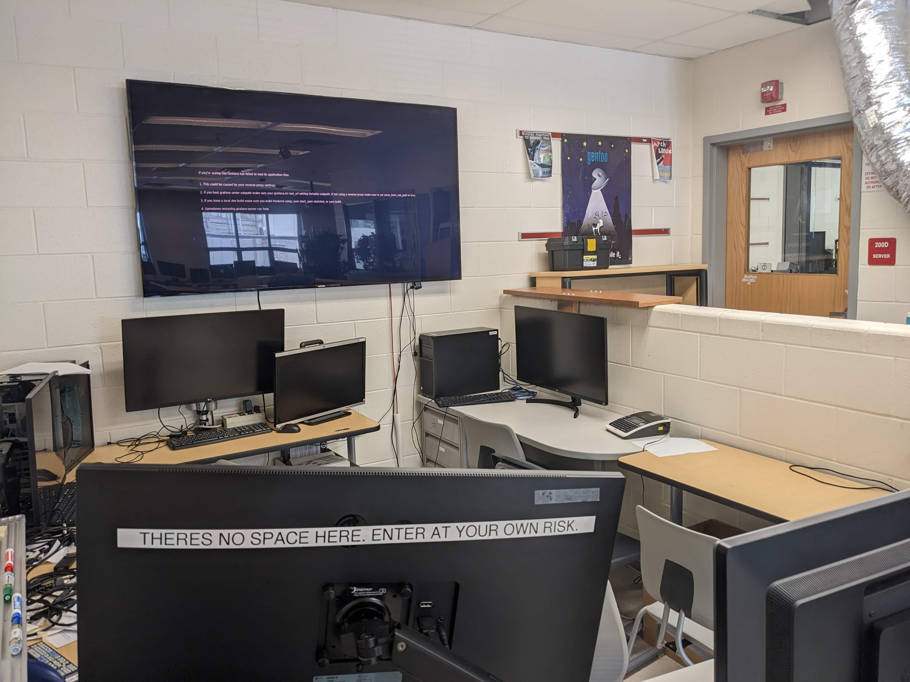

# Workstations

In the CSL, **workstations** are a group of computers that are maintained by the Sysadmins to provide TJ students and staff a Linux environment. Currently there are over 60 **HP Z240 Tower Workstations** that are located in rooms 200 and 202. These workstations are often used by computer science classes which includes Computer Vision and Artificial Intelligence. Seniors, who are enrolled in doing research for the Syslab or Web/Mobile App Development, often use our workstations as well.

## Technical Specifications

Most workstations have **similar** specifications listed below:

| Specification | Description                             |
| ------------- | --------------------------------------- |
| Motherboard   | HP 802F                                 |
| CPU           | Intel(R) Core(TM) i7-8700 CPU @ 3.40GHz |
| RAM           | 1-2x Hynix 8GB DDR4-2133                |
| GPU           | NVIDIA Quadro K620                      |
| Hard Disks    | 1 Terabyte HDD                          |
| OS            | Debian 12                               |

## The Pit Workstations

<figure><figcaption>
The Pit - June 2023
</figcaption></figure>

**The Pit Workstations** are workstations located in the Pit that are mainly intended for Sysadmin use. Some of the workstations below don't have the same specifications that are listed above.

* **`mozart`** - Runs Ubuntu 22.04, has the same specifications as other workstations.
* **`bourne`** - Runs Ubuntu 22.04, has the same specifications as other workstations.
* **`turing`** - Runs Debian 12, has the same specifications as other workstations.
* **`asm`** - Not a workstation, but it is located in the Pit. `asm` is the **most powerful** "workstation" in the Syslab. It runs Arch Linux which also makes it the only workstation in the Syslab that runs an Arch-based distribution. Currently it doesn't work.

## Room 200

Almost half of our workstations are located in Rm 200. These workstations are used mainly for AI and senior research.

* **`torvalds`**
* **`thompson`**
* **`stallman`**
* **`boyce`**
* **`hopper`**
* **`yilma`**
* **`wienckowski`**
* **`tsui`**
* **`beethoven`**
* **`emery`**
* **`walsh`**
* **`berkheimer`**
* **`winstead`**
* **`allen`**
* **`lepple`**
* **`street`**
* **`kurtz`**
* **`watson`**
* **`wozniah`**
* **`eich`**
* **`liskov`**
* **`hartmanis`**
* **`babbage`**
* **`berners-lee`**
* **`wall`**
* **`captainfalcon`**
* **`amdahl`**

## Room 202 

The other half of our workstations are located in Room 202. These workstations are used mainly for computer vision and senior research.

* **`prokofiev`**
* **`hindemith`**
* **`puccini`**
* **`rachmaninoff`**
* **`wagner`**
* **`vivaldi`**
* **`stravinsky`**
* **`schumann`**
* **`handel`**
* **`gershwin`**
* **`faure`**
* **`debussy`**
* **`copland`**
* **`chopin`**
* **`brahms`**
* **`bernstein`**
* **`satie`**
* **`ravel`**
* **`scarlatti`**
* **`schubert`**
* **`berlioz`**
* **`bach`**
* **`haydn`**
* **`tchaikovsky`**
* **`mendelssohn`**
* **`pachelbel`**
* **`mahler`**
* **`vecchio`**
* **`holst`**
* **`liszt`**

## Unplugged Workstations

These workstations listed below are workstations that are not in current use. They are unplugged and some run an older version of Ubuntu.

* **`chamberlin`**
* **`danaher`**
* **`dijkstra`**
* **`feghali`**
* **`gosling`**
* **`kahn`**
* **`kleinrock`**
* **`lerdorf`**
* **`matsumoto`**
* **`postel`**
* **`ritchie`**

## Accessing the Workstations

Accessing is fairly simple when it comes to workstations. If your on VPN, just running `ssh <WORKSTATION_NAME>.csl.tjhsst.edu` (running `ssh <WORKSTATION_NAME>` should also work as well) should do the trick, however if your not on VPN, there are a few steps:


Note that you should always check if the workstation is SSHable in the first place, by simply checking if it is pingable by running `ping <WORKSTATION_NAME>`. If it is not pingable, then it is likely off or broken. Ask the Workstations Lead(s) if you have questions.


1. Open the terminal and run `ssh <YOUR_ION_USERNAME>.remote.tjhsst.edu`. This is our remote access servers, which allows you to access any CSL-related items outside of TJ. This should open a prompt that would asks you to type in your password.
2. Once your in, you should just SSH into the workstation as so: `ssh <WORKSTATION_NAME>`.

For more specific information on CSL workstations are located in [our runbooks](../general/documentation/runbooks.md).
